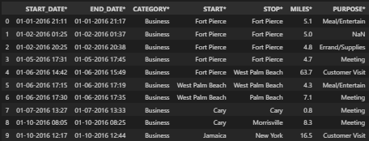
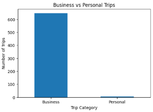
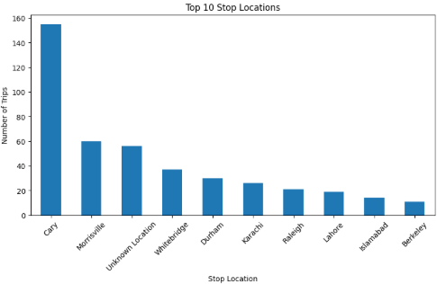
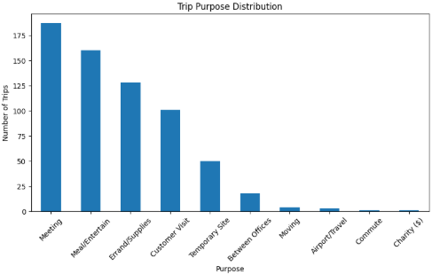
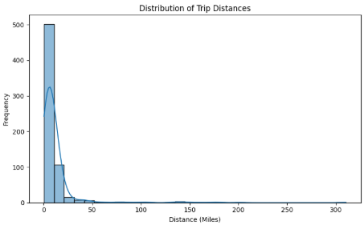
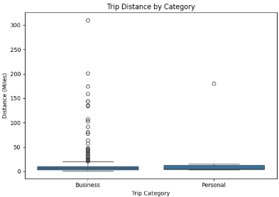

# 🚖 Uber Mobility Insights using Python

## 📖 Project Overview

Uber generates thousands of trips every day, producing valuable transportation data that can be analyzed to understand customer travel behavior and operational trends.

This project analyzes **1,156 Uber trip records** using **Exploratory Data Analysis (EDA)** techniques with **Python, Pandas, NumPy, Matplotlib and Seaborn** to uncover travel patterns, trip purposes, frequently visited locations and business insights that support data-driven decision-making.

## 🎯 Business Problem

Understanding customer travel behavior is essential for improving transportation services and operational planning.

This project analyzes Uber trip data to answer business questions such as:

- Which trip category is most common?
- Which locations generate the highest number of trips?
- What are the most frequent trip purposes?
- How are trip distances distributed?
- What business insights can be derived from customer travel patterns?

## 📂 Dataset

The dataset contains **1,156 Uber trip records** with **7 attributes** describing customer travel behavior.

| Column | Description |
|--------|-------------|
| START_DATE* | Trip start date and time |
| END_DATE* | Trip end date and time |
| CATEGORY* | Trip category (Business/Personal) |
| START* | Pickup location |
| STOP* | Drop-off location |
| MILES* | Distance traveled (miles) |
| PURPOSE* | Purpose of the trip |

## 🛠️ Tools & Technologies

- **Programming Language:** Python
- **Libraries:** Pandas, NumPy, Matplotlib, Seaborn
- **Development Environment:** Visual Studio Code (Jupyter Notebook)

## 🧠 Python Concepts Used

This project demonstrates the following Python concepts:

- Data Loading
- Data Cleaning
- Missing Value Analysis
- Duplicate Detection
- Data Filtering
- GroupBy Operations
- Value Counts
- Statistical Analysis
- Data Visualization
- Exploratory Data Analysis (EDA)

## 🔄 Project Workflow

1. Import Required Libraries
2. Load the Dataset
3. Understand the Dataset
4. Clean and Prepare the Data
5. Perform Exploratory Data Analysis (EDA)
6. Create Data Visualizations
7. Generate Business Insights
8. Draw Final Conclusions

## ❓ Business Questions Answered

This analysis answers the following business questions:

1. Display the first and last 10 records.
2. Understand the dataset structure.
3. Check missing values and duplicate records.
4. Identify trip categories.
5. Determine the most frequent pickup and drop-off locations.
6. Analyze trip purposes.
7. Calculate trip distance statistics.
8. Compare Business vs Personal trips.
9. Visualize travel patterns using charts.
10. Generate business insights from the data.

## 💡 Key Business Insights

- Business trips account for the vast majority of Uber travel.
- Cary is the busiest pickup location in the dataset.
- Cary is also the most common drop-off location.
- Meetings are the most frequent purpose of travel.
- Most Uber trips are short-distance journeys.
- The trip distance distribution is highly right-skewed with a few long-distance outliers.
- Business trips exhibit more extreme distance outliers than personal trips.

## 📁 Repository Structure

```
Uber-Mobility-Insights-Python/
│
├── Uber_Mobility_Insights.ipynb
├── uberdrive.csv
├── Dataset_Preview.png
├── Business_vs_Personal_Trips.png
├── Top_10_Start_Locations.png
├── Top_10_Stop_Locations.png
├── Trip_Purpose_Distribution.png
├── Trip_Distance_Histogram.png
├── Trip_Distance_Boxplot.png
└── README.md
```

## 📊 Project Visualizations

### 📌 Dataset Preview



---

### 🚖 Business vs Personal Trips



---

### 📍 Top 10 Start Locations


---

### 📍 Top 10 Stop Locations



---

### 🎯 Trip Purpose Distribution



---

### 📈 Trip Distance Distribution



---

### 📦 Trip Distance Comparison



## 🚀 How to Run

1. Clone this repository.

```bash
git clone https://github.com/saishradhaconnect/Uber-Mobility-Insights-Python.git
```

2. Install the required libraries.

```bash
pip install pandas numpy matplotlib seaborn
```

3. Open the notebook.

```text
Uber_Mobility_Insights.ipynb
```

4. Run all cells to reproduce the analysis and visualizations.
